# Prost
## Table of Contents
1. [About](#about)
2. [Details](#details)
3. [System Requirements](#details)
4. [Database](#database)
5. [Installation](#installation)
6. [Deployment](#deployment)
7. [Tech Stack](#tech-stack)
8. [Database Schema](#database-schema)
9. [Contributing](#contributing)

 
## About
**Prost:** Creating social environments for the consumption of alcohol while promoting both safety and local businesses.
### Details
Prost aims to create safe drinking environments to promote both relaxing with friends and those who are yet to be called friends all while having a delicious drink. Users can go solo or create parties and place themselves on our map to be seen by the public or only their friends.  Privacy is a big concern here and users have complete control over who they share their location with.  Users can create a friends list, plan events through private messages, check their area for new spots to frequent or curate a list of their favorite watering holes, view the varying status of any of the participating bars and restaurants including population, indoor / outdoor, masks or no masks, etc.
 
On the other hand, if you are a business owner, register with us and experience a new, fluid method of communication with your customers. Alert them to promotions, popup events, crowd numbers, and keep them up to date about the going-ons in your business.
 
Prost wants to help you find your next favorite watering hole while keeping you safe.
 
## The Team
**Product Owner, Developer**: Christopher Booth
<br>
**Scrum Master, Developer**: Lawerence Schwall
<br>
**Developer**: Jon Tenholder
<br>
**Developer**: Brianna Skinner
## System Requirements:
Use `node --version` `npm --version`to check your current version of [Node.js and npm](https://docs.npmjs.com/downloading-and-installing-node-js-and-npm). Upgrade to 12, if not currently on version 12.
 
 - Node version >= 8
 - npm >= 6
 
## Database
First, install PostgreSQL 12 on your machine:
https://www.postgresql.org/download/
 
Below are a few helpful commands to get started. You can find more [here](https://www.postgresqltutorial.com/psql-commands/).
 
### Starting Database:
**Mac**
```
brew services start postgresql
```
**Linux**
```
sudo service postgresql start
```
### Logging In:
**Mac**
```
psql -W {username}
```
**Linux**
```
sudo -u {username} psql // without the curly braces
```
### Create PostgreSQL Database
```
CREATE DATABASE prost;
```
### Test data
If you need test data after, first complete setting up the project. Next, start the server.
```
npm run start
```
Finally, use the command below to populate the test data.
```
npm run test-db
```
 
## Database for deployment
 
Install: 
``` 
sudo apt update
sudo apt install postgresql postgresql-contrib
```
Loggin In:
```
sudo -i -u postgres
```
## Installation
From the CodingUnderTheInfluence/Prost repository, fork your copy of the project. Next, clone your repository to your local machine by running the following code in your command prompt.
 
```
$ git clone {your GitHub project link}
 
$ cd Prost/
 
$ npm install
```
## Deployment
Depoyment steps based on Digital Ocean.

### Set up
Install Node and NPM:
```
curl -sL https://deb.nodesource.com/setup_12.x | sudo -E bash -

sudo apt install nodejs

node --version
```
Clone Repo:
```
git clone {repo-name.git}
```
cd into Project and install dependencies:
```
npm install
```
Build project 
```
npm run build
```
Start project to test:
```
npm start
```

### set up PM2

[PM2](https://pm2.keymetrics.io/docs/usage/pm2-doc-single-page/)

Install PM2 globally 
```
sudo npm i pm2 -g
```
Start Project with PM2, make sure your project isn't running
```
^c {control c}
```
To actually start project on PM2
```
pm2 start server/index.js
```
Other important PM2 commands:
```
pm2 l -- shows list
pm2 stop {name}
pm2 start {name}
pm2 restart {name}
```


### set up firewall

```
sudo ufw enable
sudo ufw status
sudo ufw allow ssh (Port 22)
sudo ufw allow http (Port 80)
sudo ufw allow https (Port 443)
```


### install NGNIX and configure

[NGNIX](https://docs.nginx.com/?_ga=2.78474513.420659996.1605509840-1622538564.1605061935)
```
sudo apt install nginx

sudo vim /etc/nginx/sites-available/default
```
Add into the location / in server block:
If you've register a domain name add it to server_name
```
server_name yourdomain.com www.yourdomain.com;

    location / {
        proxy_pass http://localhost:3000;
        proxy_http_version 1.1;
        proxy_set_header Upgrade $http_upgrade;
        proxy_set_header Connection 'upgrade';
        proxy_set_header Host $host;
        proxy_cache_bypass $http_upgrade;
    }
```

Check NGINX config to make sure it is OK 
and restart NGINX
```
sudo nginx -t

sudo service nginx restart
```

should be able to view site without going to port 3000. All other ports will be blocked.


### Add domain name in Digital Ocean (if one is registered)

Go to networking and add a domain. Add an @ for yourdomain.com


### Register domain

Wherever you regestred your domain add. Could take an hour or more to go through.
```
ns1.digitalocean.com
ns2.digitalocean.com
ns3.digitalocean.com
```


### Add SSL and LetsEncrypt

[certbot](https://certbot.eff.org/lets-encrypt/ubuntuother-nginx.html)
```
sudo add-apt-repository ppa:certbot/certbot
sudo apt-get update
sudo apt-get install python-certbot-nginx
sudo certbot --nginx -d yourdomain.com -d www.yourdomain.com

# Only valid for 90 days, test the renewal process with
certbot renew --dry-run
```

Should now be able to go to [prost](https://yourdomain.com) and see the app.


### Tools
#### Google
- Sign up with Google console and create, or go to an exisiting [project](https://cloud.google.com/resource-manager/docs/creating-managing-projects). 
- You will need to enable a few [Google Cloud APIs](https://cloud.google.com/apis/docs/getting-started). Google Translate API (Basic), Google Maps API (JavaScript), Google Places API, Google Geocoding API, Google GeoLocation API, and Google Directions API.
- Next, you'll need create [Google OAuth2.0](https://support.google.com/googleapi/answer/6158849) credentials, enable the [API Key](https://support.google.com/googleapi/answer/6158862), and get a [Service Account JSON key](https://cloud.google.com/iam/docs/service-accounts).
- The Service Account JSON should be placed in the root directory of the project as _serviceacc.json_. If the JSON file is not included in the _.gitignore_, please include it.
### Environmental Variables
Place in a .env file in the root directory containing the following variables.
```
SEQUEL_PASS= // Postgres password
SEQUEL_HOST= // Postgres host
SEQUEL_PORT= // Postgres port
SEQUEL_USER= // Postgres username
SEQUEL_DATABASE= // Postgres database name
```
### Environment Variables for Frontend
```
GOOGLE_MAPS_API_KEY= // API Key from your Google Console
GOOGLE_CLIENT_ID= // Client Id from Google OAuth2.0
GOOGLE_CLIENT_SECRET= // Client Secrete from Google OAuth2.0
```
### Environment Variables for Backend
```
REDIRECT= // The URL your project should redirect to after authentication 
jwtSecret= // String of your choice for the JSON Web Token
PROJECT_ID=// The project ID associated with your Google Service JSON Key 
```
### Starting the Server
```
npm start
```
### Compiling the Build
Development Build
```
npm run dev
```
Production Build
```
npm run build
```
## Tech Stack
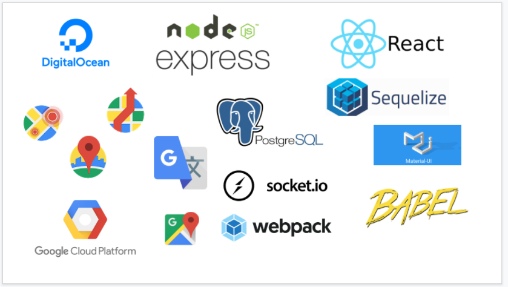

## Database Schema
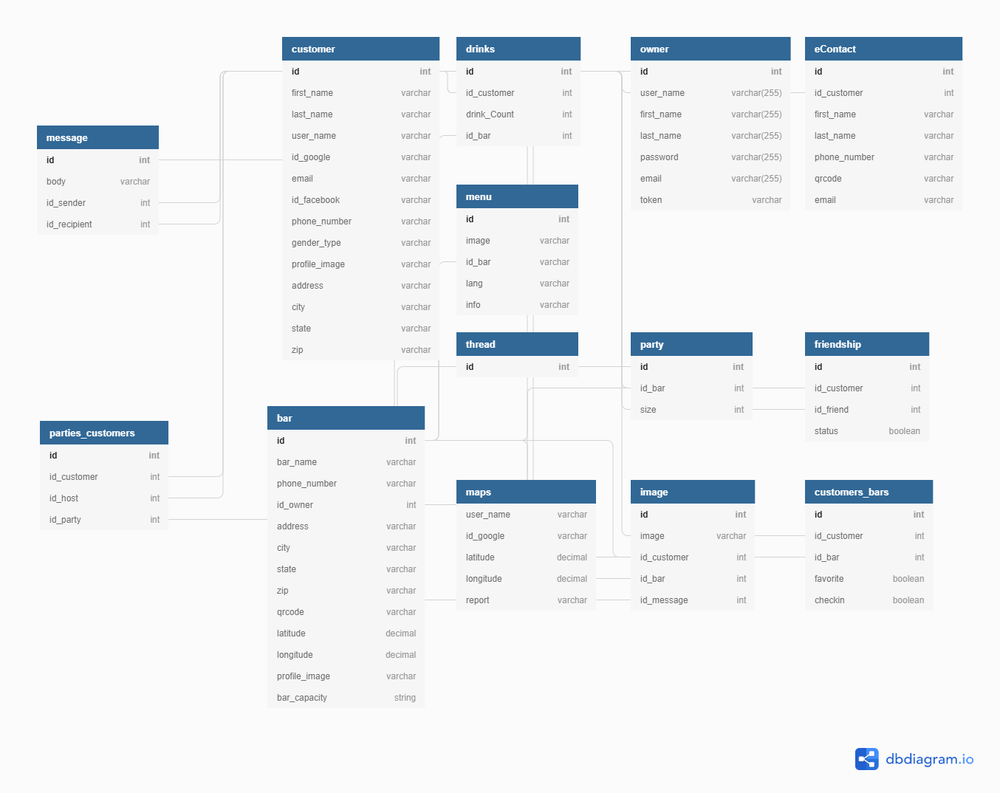

## Wire Frame
### **Customer's View**
<hr>

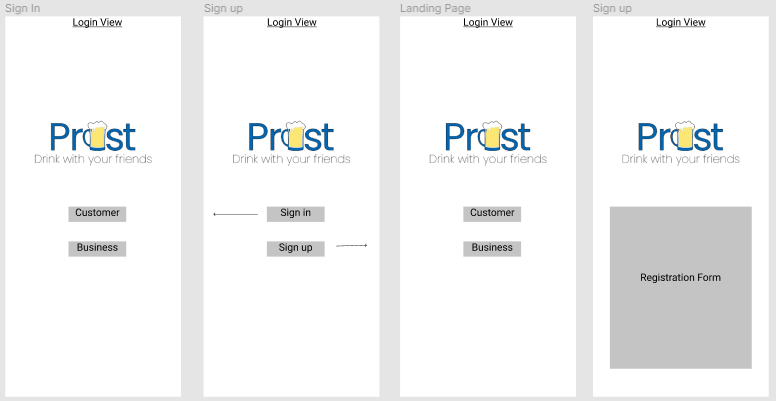
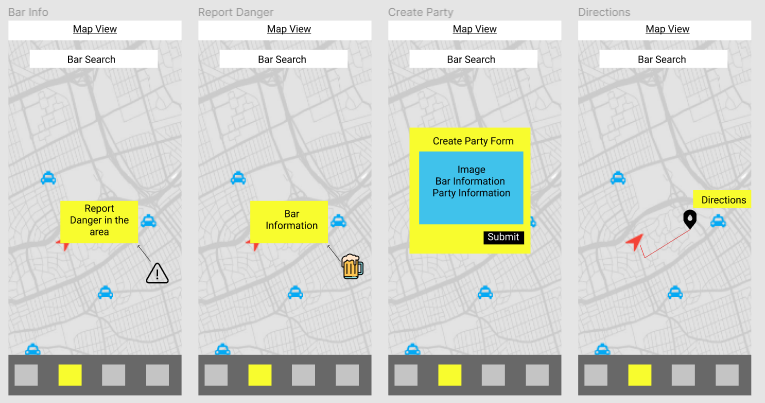
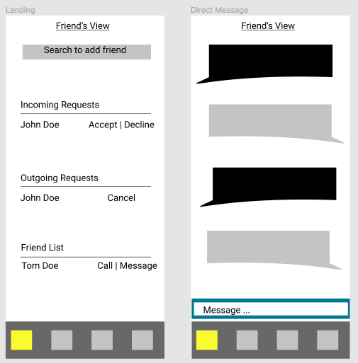
<br>
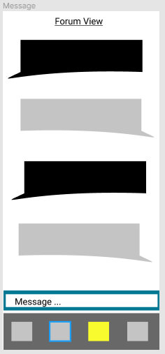
<br>
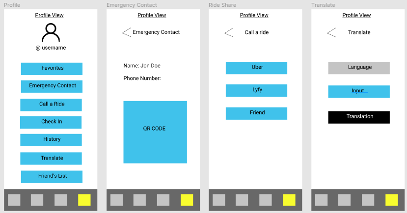
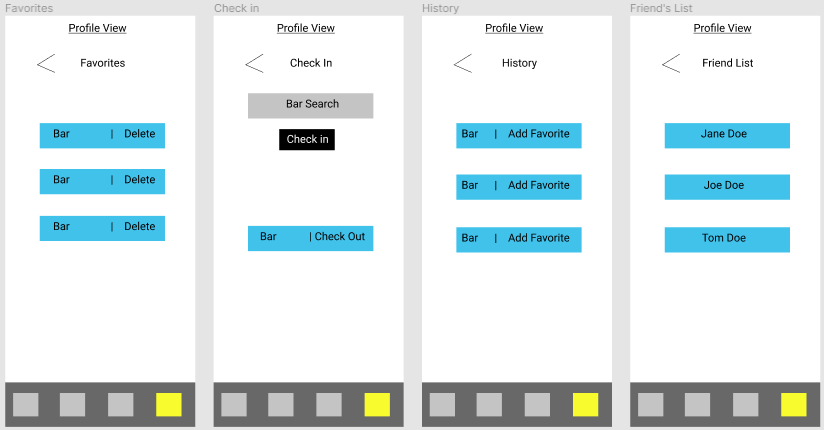
### **Owner's View**
<hr>

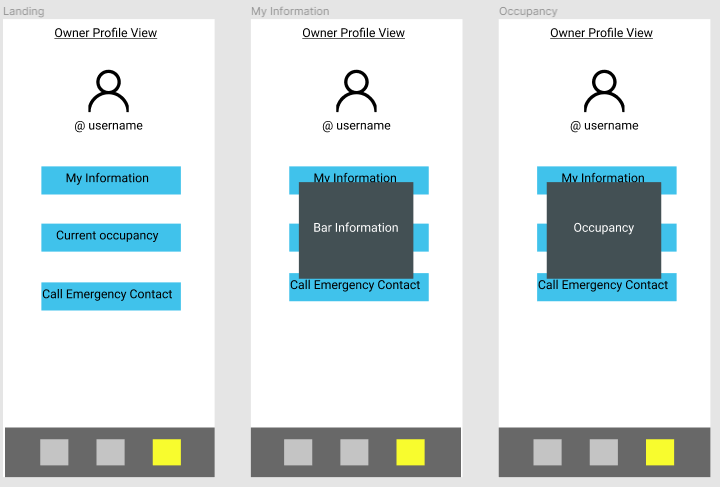
<br>
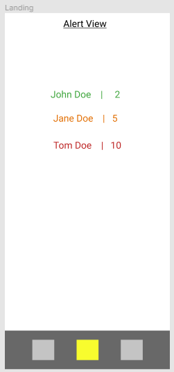
<br>
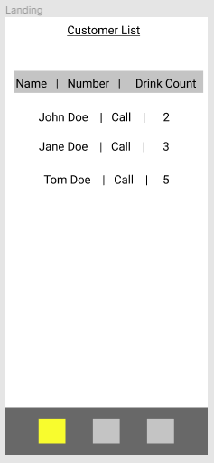


## Contributing
See [_CONTRIBUTING.md_](CONTRIBUTING.md).